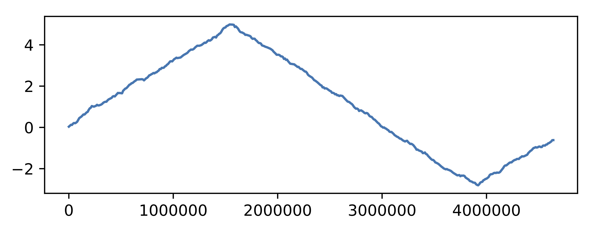

## GC skew（前回の続き）

えー先週の課題、課題1はみんな良くできていましたが、課題2は人それぞれでした。ちゃんとリファレンスつけてくれた人偉いです笑。

"GC skew"でググるだけで、何故バクテリアの"GC skew"に明確なシフトが見られるかについての説明（仮説）しているサイトが色々でてきたと思います。基本的にバクテリアのゲノムは環状構造になっていて、複製開始点から右半分と左半分が別々に複製されていく。最終的に終結点で互いが落ち合わけだが、このとき右半分と左半分では複製のされ方が異なります。この複製のされ方によって生じた変異率等の差がGC skewとして現れていると考えられています。現状のプロットでも十分GC skewの特徴をつかむことができますが、もう少し特徴がはっきりと分かるplotをしてみましょう。

````Python
#plot2.py
import sys
import matplotlib.pyplot as plt
if __name__ == "__main__":
    positions = [] 
    values    = [] 
    cum_value = 0
    with open(sys.argv[1],"r") as f:
        f.readline()#一行目はseqidとwindow sizeを示すメタ情報なのでスキップ
        for line in f:
            row = line.rstrip().split(",")
            positions.append(int(row[0]))#ポジションは整数に変換 
            cum_value += float(row[1]) 
            values.append(cum_value)
    fig = plt.figure(figsize=(6,2))
    ax  = fig.add_axes([0.1,0.1,0.8,0.8])
    ax.plot(positions,values)
    fig.savefig(sys.argv[1].replace(".txt",".pdf"),bbox_inches="tight")
````

結果の図とスクリプトから、このプロットが何をプロットしているか考えてみよう。ネタバレをすると、このプロットの最大値と最小値が複製開始点と終結点を推定することができる。(実を言うとSFCの荒川准教授が学生時代に開発したG-languageを使うと"find_ori_ter()"という関数1つで、GC-skewの計算から複製開始点と終結点を予測までを自動で行ってくれる。ただ、私にはPerlは使えないので、G-languageも使えません。。。)


## GenBank Fileの扱い方

基本的に、ゲノム配列について多角的な解析を行いたいのであればGenBank形式のファイルを扱うことをお勧めする。前回の授業で扱ったのはFASTAと呼ばれる形式のファイルだが、FASTAファイルにはSequence IDと配列情報から構築される。したがってFASTA形式ではゲノム配列中に存在する各遺伝子の位置や、機能、アミノ酸翻訳配列等々、その他の情報を書き込むことができません。一方、GenBankには遺伝子の位置、翻訳配列、遺伝子の機能、tRNAの位置、種類およびゲノムをシークエンスした際のメタデータ等、ゲノム解析をするために必要な情報が全て含まれている。ただし、以下のようにフォーマットが少々複雑になっている。

````
LOCUS       BT010221                1559 bp    mRNA    linear   INV 14-AUG-2003
DEFINITION  Drosophila melanogaster RH01460 full insert cDNA.
ACCESSION   BT010221
VERSION     BT010221.1  GI:33636482
KEYWORDS    FLI_CDNA.
SOURCE      Drosophila melanogaster (fruit fly)
  ORGANISM  Drosophila melanogaster
            Eukaryota; Metazoa; Arthropoda; Hexapoda; Insecta; Pterygota;
            Neoptera; Endopterygota; Diptera; Brachycera; Muscomorpha;
            Ephydroidea; Drosophilidae; Drosophila; Sophophora.
REFERENCE   1  (bases 1 to 1559)
  AUTHORS   Stapleton,M., Brokstein,P., Hong,L., Agbayani,A., Carlson,J.,
            Champe,M., Chavez,C., Dorsett,V., Dresnek,D., Farfan,D., Frise,E.,
            George,R., Gonzalez,M., Guarin,H., Kronmiller,B., Li,P., Liao,G.,
            Miranda,A., Mungall,C.J., Nunoo,J., Pacleb,J., Paragas,V., Park,S.,
            Patel,S., Phouanenavong,S., Wan,K., Yu,C., Lewis,S.E., Rubin,G.M.
            and Celniker,S.
  TITLE     Direct Submission
  JOURNAL   Submitted (14-AUG-2003) Berkeley Drosophila Genome Project,
            Lawrence Berkeley National Laboratory, One Cyclotron Road,
            Berkeley, CA 94720, USA
COMMENT     Sequence submitted by:
            Berkeley Drosophila Genome Project
             Lawrence Berkeley National Laboratory
            Berkeley, CA 94720
             This clone was sequenced as part of a high-throughput process to
            sequence clones from Drosophila Gene Collection 1 (Rubin et al.,
            Science 2000). The sequence has been subjected to integrity checks
            for sequence accuracy, presence of a polyA tail and contiguity
            within 100 kb in the genome. Thus we believe the sequence to
            reflect accurately this particular cDNA clone. However, there are
            artifacts associated with the generation of cDNA clones that may
            have not been detected in our initial analyses such as internal
            priming, priming from contaminating genomic DNA, retained introns
            due to reverse transcription of unspliced precursor RNAs, and
            reverse transcriptase errors that result in single base changes.
            For further information about this sequence, including its location
            and relationship to other sequences, please visit our Web site
            (http://fruitfly.berkeley.edu) or send email to
            cdna@fruitfly.berkeley.edu.
FEATURES             Location/Qualifiers
     source          1..1559
                     /organism="Drosophila melanogaster"
                     /mol_type="mRNA"
                     /strain="y; cn bw sp"
                     /db_xref="taxon:7227"
     gene            1..1559
                     /gene="ninaE"
                     /db_xref="FLYBASE:FBgn0002940"
     CDS             173..1294
                     /gene="ninaE"
                     /note="Longest ORF"
                     /codon_start=1
                     /product="RH01460p"
                     /protein_id="AAQ23539.1"
                     /db_xref="GI:33636483"
                     /db_xref="FLYBASE:FBgn0002940"
                     /translation="MESFAVAAAQLGPHFAPLSNGSVVDKVTPDMAHLISPYWNQFPA
                     MDPIWAKILTAYMIMIGMISWCGNGVVIYIFATTKSLRTPANLLVINLAISDFGIMIT
                     NTPMMGINLYFETWVLGPMMCDIYAGLGSAFGCSSIWSMCMISLDRYQVIVKGMAGRP
                     MTIPLALGKIAYIWFMSSIWCLAPAFGWSRYVPEGNLTSCGIDYLERDWNPRSYLIFY
                     SIFVYYIPLFLICYSYWFIIAAVSAHEKAMREQAKKMNVKSLRSSEDAEKSAEGKLAK
                     VALVTITLWFMAWTPYLVINCMGLFKFEGLTPLNTIWGACFAKSAACYNPIVYGISHP
                     KYRLALKEKCPCCVFGKVDDGKSSDAQSQATASEAESKA"
ORIGIN      
        1 ggcaggtttc caacgaccaa tcgccgcgac tagtccgccc cagtgaaata ttcagaatcc
       61 aggaaccctt tatgtaaaaa gtgttagaaa tattgttagt gaatttgcag ctttttatgt
      121 agacagtgtg atataggcgg gatatagtga cgcagccagt aaccaaaaca caatggagag
      181 ctttgcagta gcagccgcgc aactggggcc acactttgcc cccctgtcca atggatcggt
      241 ggtggacaag gtcacgcccg acatggccca cctgatcagc ccgtactgga accagttccc
      301 cgccatggac cccatttggg ccaagatcct gaccgcctac atgatcatga tcggcatgat
      361 ttcctggtgc ggaaatggcg tggtgatcta catattcgcc accaccaaat cactgcgcac
      421 gcccgctaac ctgctggtca tcaacctggc catctccgac tttggcatca tgatcacaaa
      481 cacgcccatg atgggcataa atctgtattt cgagacctgg gtgctcggac ccatgatgtg
      541 cgacatatac gccggactgg gctcggcctt tggctgcagc tccatctggt ccatgtgcat
      601 gatctccctg gatcgctacc aagtgatcgt caagggcatg gccggccggc cgatgaccat
      661 tccgctggcc ctgggcaaga ttgcctacat ctggttcatg tcgagcattt ggtgcctggc
      721 gcccgccttc ggctggagca ggtatgtgcc ggagggtaac ctgacctcgt gcggtattga
      781 ctacttggaa cgcgactgga acccacgctc atacctgatc ttctactcca tcttcgtgta
      841 ctatattccg ctgttcctga tctgctactc ttactggttc atcattgctg ctgtctccgc
      901 ccacgagaag gccatgcgcg agcaggccaa gaagatgaat gtcaagtccc tccgctcctc
      961 tgaggatgcc gagaagagcg ccgagggcaa gctggccaag gtggctctgg tcaccatcac
     1021 gctgtggttc atggcgtgga caccatacct ggtcatcaac tgcatgggac tgttcaagtt
     1081 cgagggcctt acaccactga ataccatttg gggagcttgc ttcgccaaat cggccgcctg
     1141 ctacaatcca attgtatacg gcatcagcca tccgaaatat cgcctggccc tcaaggagaa
     1201 gtgtccttgc tgcgtctttg gcaaggtcga cgatggcaaa tcgagcgatg cccaatcgca
     1261 ggccaccgcc agcgaggccg agtccaaggc ataaattctt tggcgcaaca accagaacag
     1321 caacaacaac aacaagaaca tctaactact tacaacagca acaacaacag caacaaaaac
     1381 aacagcaaga acaactgcag caacagaacg aaacgctttc gaataacatc aaaaacttca
     1441 acaataatga aaaaattatg caactttctt acataacaaa aagcaatgta aactcagtta
     1501 ttaaatttcc tgcaatgtca gttaaggaca aaaaaaaact caacaaaaaa aaaaaaaaa
````

とまぁ、こんな感じである。実際には、より多くの情報が加えることができるためGenBank形式のデータを扱うのは一筋縄ではいかない。しかし、BioPythonを使うとこんな複雑なGenBankフォーマットも割と簡単に扱うことができるので紹介する。

### 遺伝子情報の取得
原核生物のゲノムには大体、ゲノム長/1000 個の遺伝子が存在する。各々の遺伝子はどのような機能や特徴を持っているのだろうか。というときは以下のようなスクリプトを書けばいい。

````Python
#view_gbk.py
from Bio import SeqIO 
def get_CDS_info(gbk):
    for feat in gbk.features:
        start = feat.location.parts[0].start.position #Featureの開始位置
        end   = feat.location.parts[-1].end.position　#Featureの終了位置
        print(start+1,end,feat.strand,feat.type)　#GenBankでの表示と同じになるように補正。
        for key in feat.qualifiers:
            print(key,feat.qualifiers[key][0])
        print() 

if __name__ == "__main__":
    for gbk in SeqIO.parse("../sample_genome/sample.gbk","genbank"):
    	get_CDS_info(gbk)
````

以下解説。

**gbk.features**
FEATURESの情報が記録されたlist。各要素はFeature型というBiopythonが用意した特別な型(Class)になっていて、```.type```や位置情報を示す```.location```、遺伝子のメタデータ(```/~=~```の部分)```.qualifiers```等を持つ。各々の詳細について以下に示す。

>- ```.type```
>
>  gene, CDS, repeat region等、Featureのtype情報を示す。GeneBankで一般的に用いることができるFeature typeについては、以下のサイトを参考にするとよい。geneとCDSの定義の違い等もここをよむとわかる。https://www.ddbj.nig.ac.jp/ddbj/features.html
>
>  ​
>
>- ```.strand```
>
>  遺伝子やその他のFeatureが(+)鎖、(-)鎖にコードされているかの情報を示す。(+)鎖の場合、値は+1。(-)鎖の場合は-1を示す。
>
>  ​
>
>- ```.location```
>
>  遺伝子の位置情報を持つ型。一般的にGenbankにおいて位置は[start]..[end]で表される。ただし、start..>endやstart<..endといった形式があり、この場合はそのFeatureが [start]から[end]までは続いているがさらに下流や上流に続いていることを示している。
>  また、FeatureがCDS(coding sequence)である場合は、スプライシングを考慮して、位置情報からもイントロン部分が取り除かれて、エクソンの部分だけを抽出されなければならない。この場合Genbankでは、   join(start1..start2,start2..end2)という形式で表される。とまぁ上記のように位置ひとつとっても形式が複雑なため、locationも以下のように複数の情報をもつ。
>  - .locaiton.start : "start"もしくは"start<"を示す。"start<"の場合は数値として扱えないので注意
>  - .location.start.position : "start"を示す。数値として扱える。
>  - .locaiton.end : "end"もしくは"end<"を示す。"start<"の場合は数値として扱えないので注意
>  - .locaiton.end.position : "end"を示す。数値として扱える。 
>  - .location.parts : 各要素が上4つの情報を持つlistを示す。
>  とまぁ長々と書いたが、サンプルスクリプトにも示したように、各featureのstartとendを知りたいときには、```feat.location.parts[0].start.postion```、```feat.location.parts[-1].end.postion```を使うのが無難である。これなら、どんな場合でも必ず数値で、Featureの開始位置と終了位置を得ることができる。
>
>  また、おせっかいなこと```start```、```start.postion```や```end```、```end.postion```は全て、Pythonにおける数字の扱いかたに合わせて返ってくる。なので、startは0位置から始まるようになっていることに注意。GenBank中の表示をそのまま手に入れたい場合は、start.positionに+1してあげる必要があるので注意。EndについてはGenBankの表示と変わらないが、これはPythonでrange(0,10)としたときに10を含まないのに合わせて、終了位置+1をわざわざ返してくれているのである。
>
>  逆鎖にコードされているFeatureについても、小さい数字が必ずstart位置として返ってくる。これも注意が必要。strandの情報を手にいれたいときは```.strand```を用いる。
>
>  ​
>
>- ```.qualifiers```
>
>  Fetureに関するメタデータの辞書。例えば上記のGenbankにおける```CDS             173..1294```のfeatを例にとると、そのqualifiersは
>
>  ``````
>  {'gene': ['ninaE'], 'note': ['Longest ORF'], 'codon_start': ['1'], 'product': ['RH01460p'], 'protein_id': ['AAQ23539.1'], 'db_xref': ['GI:33636483', 'FLYBASE:FBgn0002940'], 'translation': ['MESFAVAAAQLGPHFAPLSNGSVVDKVTPDMAHLISPYWNQFPAMDPIWAKILTAYMIMIGMISWCGNGVVIYIFATTKSLRTPANLLVINLAISDFGIMITNTPMMGINLYFETWVLGPMMCDIYAGLGSAFGCSSIWSMCMISLDRYQVIVKGMAGRPMTIPLALGKIAYIWFMSSIWCLAPAFGWSRYVPEGNLTSCGIDYLERDWNPRSYLIFYSIFVYYIPLFLICYSYWFIIAAVSAHEKAMREQAKKMNVKSLRSSEDAEKSAEGKLAKVALVTITLWFMAWTPYLVINCMGLFKFEGLTPLNTIWGACFAKSAACYNPIVYGISHPKYRLALKEKCPCCVFGKVDDGKSSDAQSQATASEAESKA']}
>  ``````
>
>  みたいな辞書になっている。ここで注意してほしいのが、辞書のvalueが必ずlistになっていることである。これはdb_xrefのようにひとつのkeyに複数の要素が割り当てられることがあるためであるが、てっきりvalueは文字か数値だろうと思いこんで、期待通りの結果が得られないというBiopython初心者がハマりがちな部分である。


先のスクリプトだと、単に遺伝子の位置とメタデータをターミナルに書き出すだけだったのでゲノム全体を解析する際にあまり使い勝手がいいとはいえない。

ということで、大腸菌12株の全遺伝子情報を含むGenBankから、NCBI Protein ID、遺伝子名、CDSの位置、Strand、Product（どんなタンパク質か）を抜き出すスクリプト書いてみよう。

````Python
#get_CDS.py
from Bio import SeqIO 
def get_CDS_info(gbk):
    results = []
    for feat in gbk.features:
        start  = feat.location.parts[0].start.position #Featureの開始位置
        end    = feat.location.parts[-1].end.position  #Featureの終了位置
       	strand = feat.strand
        if feat.type == "CDS":
            if "gene" in feat.qualifiers:
                gene = feat.qualifiers["gene"][0]
            else:
                gene = "N.A."
            
            if "product" in feat.qualifiers:
                product = feat.qualifiers["product"][0]
                if "," in product:
                    product = product.replace(",",":")
            else:
                product = "N.A."
            
            if "protein_id" in feat.qualifiers:
                    protein_id = feat.qualifiers["protein_id"][0]
            else:
                protein_id = "N.A."
            results.append([gene,protein_id,str(start),str(end),str(strand),product])  
    return results

if __name__ == "__main__":
    for gbk in SeqIO.parse("../sample_genome/GCF_000005845.2_ASM584v2_genomic.gbff","genbank"):
        results = get_CDS_info(gbk)
        with open(gbk.id + "_CDS_info.csv","w") as o:
            for result in results:
                o.write(",".join(result) + "\n") 
````


## 課題:簡易比較ゲノム解析
えー今日は少し課題の時間を多めに取ります。どしどし質問してくれて構わないので、ちょっと自分で考えてやってみましょう。課題1: get_CDS.pyを少し書き換えて、以下の3つの情報を加えてみよう。できなかったら途中まででもOK。
- 難易度1:翻訳後のアミノ酸配列
- 難易度2:各CDSの長さ（塩基の数）
- 難易度3:各CDS領域におけるGC含量

出力されたCSVファイルの最初の10行分をTable形式でWord貼り付けてください。

課題2:
get_CDS.pyのGCF_000005845.2_ASM584v2_genomic.gbffをGCF_000008865.2_ASM886v2_genomic.gbffに変えて、スクリプトを実行しよう。（課題1よりこっち先にやってもOK。）

出力されたCSVファイルの最初の10行分をTable形式でWord貼り付けてください。

課題3:sample_programのディレクトリに ”NC_000913.3_CDS_info.csv"と "NC_002695.2_CDS_info.csv"ができているはずです。遺伝子名("gene")のカラムを参考に、”NC_000913.3_CDS_info.csv"にしかないCDSと、"NC_002695.2_CDS_info.csv"にしかないCDSを抜き出してみよう（エクセル使ってもPython使っても何使ってもいいので抜き出してみよう）。共有している遺伝子の数や、どちらか一方にしかない遺伝子の数、種類の情報などから、考えたことわかったことを書いてください。


